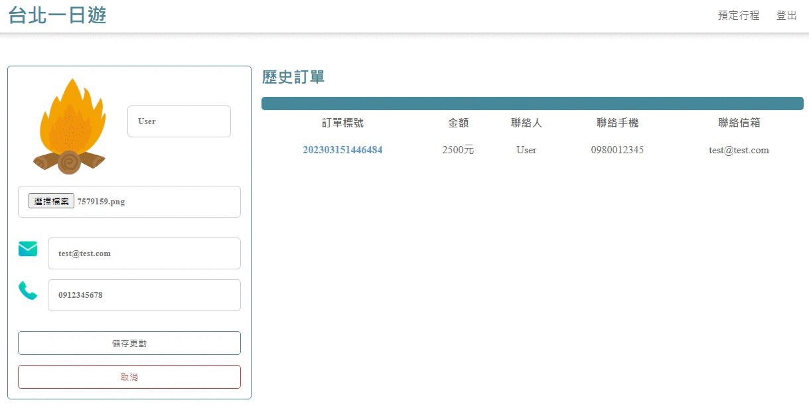

# Taipei-Day-Trip-Demo
It's a travel e-commerce website, provides users with the ability to search and book guided tours of attractions in the Taipei area.

## Test information

Test account:

* User : test@test.com
* Password : 123456

Test payments:

* Card number : 4242-4242-4242-4242
* Expiration date : 01/24
* CVV : 123

## Feature description
* Using IntersectionObserver for dynamic loading

* RWD

* Seamlessly book attractions using third-party payment.

* Member supports changing avatars and querying orders.

## Skills
* Use Flask as server framework
* Get the attractions' API by AJAX
* Design API by RESTful API style
* MySQL uses the connection pool and set index to optimize the query
* Use Git/GitHub for version control
* Third-Party Payment System: TapPay
